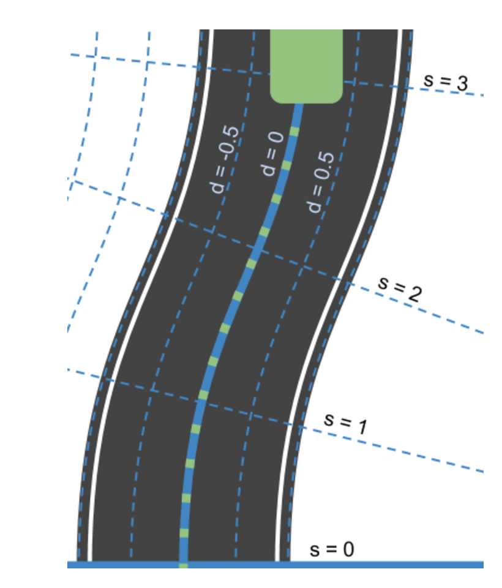

# Self-Driving Car Engineer Nanodegree
# Behavior prediction 
## Side-project: Gaussian Naive Bayes classifier to predict the behavior of vehicles on a highway

### Overview
This is a side project of the [Self Driving Car Engineer Nanodegree](https://www.udacity.com/course/self-driving-car-engineer-nanodegree--nd013) I am taking part.  
The aim of this project was to train a Gaussian Naive Bayes classifier to detect on which maneuvers a vehicle is engaged  

### Results
By using raw provided data, I was able to predict on which maneuvers the vehicle was engaged with a certainty of 84.39%. 

### Dataset
The dataset is composed on several samples representing the current state of the vehicle. The vehicle is represented using the Frenet coordinates, as represented below: 
 

Each coordinate contains 4 pieces of information:
* s
* d
​* s dot (derivative from s)
​* d dot (derivative from d)
​​
### Goal
Based on these coordinates, predict on which maneuver the vehicle is engaged, as shown by the picture below

* Change lanes left (shown in blue)
* Keep lane (shown in black)
* Change lanes right (shown in red)
